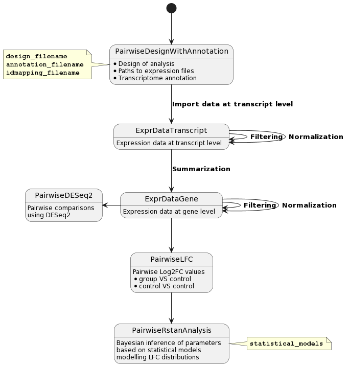

# nexodiff: RNA-seq Differential Expression Analysis

`nexodiff` is an R package for performing differential expression analysis on RNA-seq data. It provides a flexible, object-oriented framework for analyzing, visualizing, and interpreting gene expression data from complex experimental designs.

The package is built around a series of `R6` classes that guide the user through the analysis pipeline, from reading annotation and design files to performing statistical analysis and generating plots.

## Workflow Overview

The typical analysis workflow follows these steps, which are also illustrated in the diagram below:

1.  **Setup**: Define the experimental layout with a `PairwiseDesign` object and load gene/transcript information with an `Annotation` object.
2.  **Data Handling**: Import transcript-level abundances (e.g., from Kallisto) into an `ExprDataTranscript` object. This data can then be normalized, filtered, and summarized into gene-level counts in an `ExprDataGene` object.
3.  **Analysis**: Use an analysis class like `PairwiseDESeq2` to perform differential expression testing on the gene-level data. The results can be explored through various plotting functions (MA plots, volcano plots, heatmaps) and exported.


## Installation

You can install the development version of `nexodiff` from GitHub with:
```R
# install.packages("devtools")
devtools::install_github("nexomis/nexodiff")
```

The official release version is `1.0.0`. Version `1.0.1` is planned for the next release cycle.

## Testing

This package uses `testthat` for unit testing. To run the tests, use the following command from the package's root directory in an R session:
```R
devtools::test()
```

[](https://github.com/nexomis/nexodiff/actions/workflows/R-CMD-check.yaml)


## Getting Started

For a detailed guide and practical examples, please see the "Examples" vignette included with the package.

