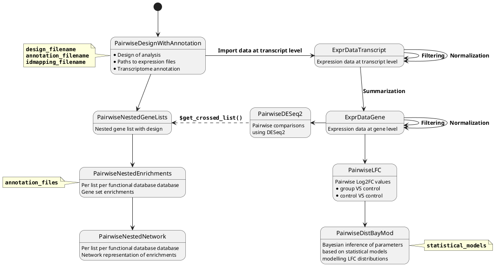

[[_TOC_]]

# 1. Installation

First clone the repository to `PATH` and then install on R:


## 1.1 Build documentation

```
devtools::build_vignettes(pkg = PATH)
roxygen2::roxygenize(package.dir = PATH)
```

## 1.2 Build and install the library

```
devtools::install_local(path=PATH,force=T,upgrade = 'never')
```

# Getting started 

See the vignette `Examples`


# check dependencies 

```
cat R/* | grep "::" | sed -re "s/.*[\(\[ ]([a-zA-Z0-9_]+)\:\:.*/\1/g" | sort -u | xargs | sed 's/ /, /g'
```