# Integration Test Reorganization Plan

## Overview

This plan outlines the restructuring of [`tests/testthat/test-integration-annotation-https.R`](tests/testthat/test-integration-annotation-https.R) to:
1. Add Ensembl GFF URL testing (Saccharomyces cerevisiae, tax_id 559292)
2. Remove redundant tests already covered in unit tests
3. Add robust snapshot testing for table headers
4. Ensure minimum gid-to-uniprot mapping coverage (5000+)

---

## Current Test Analysis

### Existing Tests (NCBI GFF only)

The current integration test ([`test-integration-annotation-https.R`](tests/testthat/test-integration-annotation-https.R:1)) covers:

| Test Category | Lines | Redundant? |
|--------------|-------|------------|
| R6 class check | 26-33 | Yes - covered in [`test-unit-annotation-class.R`](tests/testthat/test-unit-annotation-class.R:15) |
| NULL check | 22-25 | Yes - covered in unit tests |
| Inheritance check | 30-33 | Yes - covered in unit tests |
| `get_from_ids()` availability | 36-43 | Yes - covered in unit tests |
| Write to directory & reload | 45-66 | **Keep** - Integration-specific |
| Specific mapping checks (SEO1 gene) | 68-93 | **Keep** - Verify actual data |
| Row count checks | 95-108 | **Modify** - Keep but adjust for new requirement |
| Full data comparison (original vs reloaded) | 136-159 | **Modify** - Replace with snapshot testing |

### Unit Test Coverage ([`test-unit-annotation-class.R`](tests/testthat/test-unit-annotation-class.R:1))

Already covers:
- R6 initialization and inheritance
- `generate_translate_dict()` for txid→symbol, txid→gid
- `export_to_df()` functionality
- `gff_type_filter` functionality
- Both NCBI and Ensembl local GFF parsing

---

## Proposed New Test Structure

### Test 1: NCBI GFF Integration (Refactored)

**Purpose**: Verify end-to-end functionality with live NCBI data

**URL**: `https://ftp.ncbi.nlm.nih.gov/genomes/all/GCF/000/146/045/GCF_000146045.2_R64/GCF_000146045.2_R64_genomic.gff.gz`

**Tests**:
1. **Initialization** - Load from HTTPS URL with `gff_source="ncbi"`
2. **Minimum Mapping Count** - Verify ≥5000 gid→uniprot mappings
3. **Snapshot Testing** - Capture headers from [`export_to_df()`](R/class_Annotation.r:207) for:
   - `from="txid"` - Verify column names and structure
   - `from="gid"` - Verify column names and structure  
   - `from="uniprot"` - Verify column names and structure
4. **Specific Mappings** - Spot-check known yeast genes (SEO1, etc.)
5. **Round-trip Test** - Write to directory, reload, verify snapshot matches

### Test 2: Ensembl GFF Integration (NEW)

**Purpose**: Verify end-to-end functionality with live Ensembl data

**URL**: `https://ftp.ensembl.org/pub/release-115/gff3/saccharomyces_cerevisiae/Saccharomyces_cerevisiae.R64-1-1.115.gff3.gz`

**Tax ID**: 559292

**Note**: Ensembl GFF requires a named vector with tax_id:
```r
annotation <- c("559292" = "https://ftp.ensembl.org/.../Saccharomyces_cerevisiae.R64-1-1.115.gff3.gz")
```

**Tests**:
1. **Initialization** - Load from HTTPS URL with `gff_source="ensembl"`
2. **Minimum Mapping Count** - Verify ≥5000 gid→uniprot mappings
3. **Snapshot Testing** - Capture headers from [`export_to_df()`](R/class_Annotation.r:207) for:
   - `from="txid"` - Verify column names and structure
   - `from="gid"` - Verify column names and structure
   - `from="uniprot"` - Verify column names and structure
4. **Cross-validation** - Compare key mappings with NCBI version
5. **Round-trip Test** - Write to directory, reload, verify snapshot matches

---

## Snapshot Strategy

### Why Snapshot Testing?

Integration tests should verify that the **structure** of the data remains consistent across runs, without being overly brittle to data updates (new genes, updated mappings).

### Implementation

Using `testthat::expect_snapshot_value()` for table headers:

```r
# Get first 10 rows for structure verification
df_tbid <- annotation_obj$export_to_df(from = "txid")
snapshot_data <- list(
  columns = names(df_tbid),
  row_count = nrow(df_tbid),
  sample_data = head(df_tbid, 10)
)
expect_snapshot_value(snapshot_data, style = "json2")
```

### Snapshot Files Structure

```
tests/testthat/_snaps/
└── integration-annotation-https/
    ├── ncbi-txid-header.md
    ├── ncbi-gid-header.md
    ├── ncbi-uniprot-header.md
    ├── ensembl-txid-header.md
    ├── ensembl-gid-header.md
    └── ensembl-uniprot-header.md
```

---

## Mapping Count Verification

### gid→uniprot Minimum Count Check

```r
gid2uniprot <- annotation_obj$generate_translate_dict("gid", "uniprot")
expect_gte(
  length(na.omit(gid2uniprot)), 
  5000,
  info = "Less than 5000 gid->uniprot mappings found"
)
```

### Rationale

- Yeast (*S. cerevisiae*) has ~6,000 genes
- Expecting ≥5,000 mappings allows for some genes without UniProt entries
- This verifies the UniProt ID mapping integration is working

---

## Test Flow Diagram

```mermaid
flowchart TD
    subgraph "Test 1: NCBI GFF"
        A1[Load from HTTPS] --> B1[Verify ≥5000 gid→uniprot]
        B1 --> C1[Snapshot txid headers]
        C1 --> D1[Snapshot gid headers]
        D1 --> E1[Snapshot uniprot headers]
        E1 --> F1[Spot-check mappings]
        F1 --> G1[Write to directory]
        G1 --> H1[Reload & verify]
    end
    
    subgraph "Test 2: Ensembl GFF"
        A2[Load from HTTPS with tax_id] --> B2[Verify ≥5000 gid→uniprot]
        B2 --> C2[Snapshot txid headers]
        C2 --> D2[Snapshot gid headers]
        D2 --> E2[Snapshot uniprot headers]
        E2 --> F2[Cross-validate with NCBI]
        F2 --> G2[Write to directory]
        G2 --> H2[Reload & verify]
    end
```



---

## Tests to Remove (Already in Unit Tests)

| Test | Reason |
|------|--------|
| `R6::is.R6()` check | Verified in [`test-unit-annotation-class.R`](tests/testthat/test-unit-annotation-class.R:15) |
| `inherits()` check | Verified in unit tests |
| `get_from_ids()` basic check | Verified in unit tests |
| Full data frame comparison | Too brittle; replace with snapshot + spot checks |

---

## Implementation Notes

### Skip Conditions
Both tests should skip if:
- Running on CRAN (`skip_on_cran()`)
- Offline (`skip_if_offline()` for both NCBI and EBI hosts)

### Timeout Considerations
UniProt ID mapping fetch can take time. The [`fetch_id_mapping()`](R/fetch_id_mapping.r:21) function already sets a 3600s timeout.

### Resource Cleanup
Use `on.exit()` or `withr::defer()` to clean up temporary directories.

---

## Success Criteria

1. ✅ Both NCBI and Ensembl tests pass when online
2. ✅ Both tests skip gracefully when offline
3. ✅ ≥5000 gid→uniprot mappings verified for both sources
4. ✅ Snapshot files created for all 6 header combinations
5. ✅ No redundant tests from unit test suite
6. ✅ Round-trip (write/reload) verification passes

---

## Files to Modify

| File | Action |
|------|--------|
| [`tests/testthat/test-integration-annotation-https.R`](tests/testthat/test-integration-annotation-https.R:1) | Complete rewrite |
| [`tests/testthat/_snaps/integration-annotation-https/`](tests/testthat/_snaps/) | Create new snapshot files |

---

*Plan created for review before implementation.*
